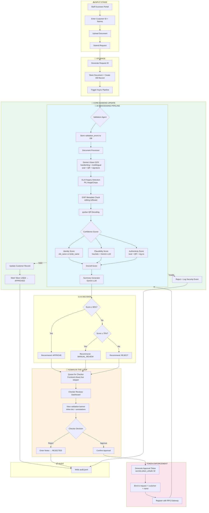

# Intelligent Account Servicing Workflow (IASW)

## AI-Powered Document Verification with Human-in-the-Loop Approval

**Technical Design Document**

---

**Version:** 2.0
**Date:** May 2026
**Classification:** Technical Assessment Submission
**Author:** AI Product Engineering Team

---

## Table of Contents

1. [Executive Summary](#1-executive-summary)
2. [Problem Understanding & Scope](#2-problem-understanding--scope)
3. [High-Level Solution Overview](#3-high-level-solution-overview)
4. [End-to-End Workflow](#4-end-to-end-workflow-step-by-step)
5. [Workflow Flowchart](#5-workflow-flowchart)
6. [System Architecture Design](#6-system-architecture-design)
7. [Agent Design](#7-agent-design)
8. [Human-in-the-Loop (HITL) Design](#8-human-in-the-loop-hitl-design)
9. [Data Model Design](#9-data-model-design)
10. [Confidence Scoring Logic](#10-confidence-scoring-logic)
11. [Technology Stack & Justification](#11-technology-stack--justification)
12. [Observability & Auditability](#12-observability--auditability)
13. [Assumptions & Limitations](#13-assumptions--limitations)
14. [Future Improvements](#14-future-improvements)

---

## 1. Executive Summary

### The Challenge

Financial institutions process thousands of account servicing requests annually—name changes, address updates, beneficiary modifications—each requiring manual verification of legal documents against existing records. This labor-intensive process creates operational bottlenecks, introduces human error, and struggles to scale with growing customer demands.

### Our Solution

The **Intelligent Account Servicing Workflow (IASW)** is an AI-powered system that automates document verification and data validation for banking account change requests while maintaining strict human oversight. The system uses **Gemini Vision** as the primary OCR and field extraction engine — handling handwritten documents, multilingual text, official seals, signatures, and QR codes in a single API call. It uses **LLM-assisted name-change plausibility scoring** to correctly model the marriage certificate domain (where the bride's new name is not written in the document). Human reviewers receive pre-analyzed summaries, live pipeline progress, and color-coded document annotations rather than raw documents.

### Why It Matters

| Dimension | Impact |
|-----------|--------|
| **Efficiency** | Reduces document review time from 15–20 minutes to under 2 minutes |
| **Accuracy** | Eliminates transcription errors through automated extraction |
| **Compliance** | Maintains complete audit trail with human approval enforcement |
| **Scalability** | Handles volume spikes without proportional staffing increases |
| **Cost** | Projected 60–70% reduction in per-request processing cost |

### Key Design Principles

1. **Automation with Accountability**: AI handles repetitive cognitive tasks; humans retain decision authority
2. **Defense in Depth**: Multiple validation layers — validation agent, Gemini Vision, ELA forgery detection, EXIF analysis, QR decoding
3. **Transparency by Design**: Every AI decision is explainable, auditable, and visible in the checker UI
4. **Fail-Safe Architecture**: System defaults to human review when confidence is low or LLM fails

> **Critical Constraint**: The AI system **NEVER** writes directly to the core banking system (RPS). Every update requires explicit human approval through a cryptographically-enforced token mechanism.

---

## 2. Problem Understanding & Scope

### Current State: The Maker-Checker Model

Banks traditionally employ a **Maker-Checker** workflow for account modifications:

```
┌─────────────────────────────────────────────────────────────────┐
│                    TRADITIONAL WORKFLOW                         │
├─────────────────────────────────────────────────────────────────┤
│                                                                 │
│   Customer      Staff         Maker           Checker    RPS    │
│      │          (Branch)     (Back Office)   (Supervisor)       │
│      │             │              │               │         │   │
│      ├─Request────►│              │               │         │   │
│      │             ├─Forward─────►│               │         │   │
│      │             │              ├─Manual────────┤         │   │
│      │             │              │  Review       │         │   │
│      │             │              │               ├─Approve─►   │
│      │◄────────────┴──────────────┴───────────────┴─────────    │
│                        Confirmation                              │
└─────────────────────────────────────────────────────────────────┘
```

### Pain Points in Current Process

| Pain Point | Description | Business Impact |
|------------|-------------|-----------------|
| **Processing Latency** | Each request requires 15–20 minutes of focused human attention | Customer dissatisfaction; SLA breaches |
| **Human Error** | Manual data entry introduces typos and misreadings | Incorrect records; compliance violations |
| **Inconsistent Standards** | Different Makers apply varying scrutiny levels | Unpredictable quality; audit findings |
| **Scalability Ceiling** | Volume spikes require overtime or temp staffing | Cost overruns; delayed processing |
| **Fatigue-Induced Errors** | Repetitive work leads to attention degradation | Missed fraud indicators; rubber-stamping |
| **Handwriting & Language** | Human readers struggle with regional scripts and handwriting | Errors with Hindi, Tamil, regional documents |

### Scope Definition

**In Scope (This Implementation):**
- Legal Name Change requests via marriage certificates
- Support for handwritten and printed documents
- Multilingual documents (English, Hindi, Tamil, and other scripts via Gemini Vision)
- Image (JPG/PNG) and PDF document formats
- Mock integrations with RPS (core banking) and FileNet (document store)

**Out of Scope (Future Phases):**
- Address change requests
- Multi-document verification (e.g., Court Order + ID simultaneously)
- Real-time RPS integration
- Mobile document capture
- Customer self-service portal

### Document Type: Marriage Certificate

Marriage certificates present a unique challenge: **they do not contain the bride's new married name**. The certificate only records:
- The bride's pre-marriage name
- The groom's name
- Marriage date, registration number, place, officiating authority

The system must therefore **infer** whether the requested new name is plausible given the bride's old name and the groom's name — using both structural heuristics and LLM semantic judgment.

---

## 3. High-Level Solution Overview

### The AI-Augmented Maker-Checker Model

IASW reimagines the traditional workflow by inserting an **AI Processing Layer** that assumes Maker responsibilities while preserving the human Checker as the ultimate authority:

```
┌─────────────────────────────────────────────────────────────────┐
│                    IASW AI-AUGMENTED WORKFLOW                   │
├─────────────────────────────────────────────────────────────────┤
│                                                                 │
│   Staff         AI Pipeline        Checker         RPS          │
│   (Intake)      (Automated)       (Human)       (Protected)     │
│      │              │                │              │           │
│      ├─Submit──────►│                │              │           │
│      │              ├─Vision OCR     │              │           │
│      │              ├─Validate       │              │           │
│      │              ├─Score names    │              │           │
│      │              ├─Detect forgery │              │           │
│      │              ├─Summarize      │              │           │
│      │              ├─Queue─────────►│              │           │
│      │              │ [live progress] │              │           │
│      │              │                ├─Review       │           │
│      │              │                ├─Decide       │           │
│      │              │                ├─Token───────►│           │
│      │◄─────────────┴────────────────┴──────────────┤           │
│                        Confirmation                              │
└─────────────────────────────────────────────────────────────────┘
```

### What AI Replaces

| Traditional Maker Task | AI Equivalent | Improvement |
|------------------------|---------------|-------------|
| Read document visually | Gemini Vision OCR | Handles handwriting, seals, multilingual |
| Extract relevant fields | Structured JSON extraction | No transcription errors |
| Cross-reference RPS | Automated validation agent | Instant verification |
| Check seal/stamp/QR | Gemini Vision + pyzbar | Consistent pattern analysis |
| Check for editing/forgery | ELA + EXIF analysis | Pixel-level forensics |
| Write summary for Checker | LLM-generated summaries | Standardized format |

### What Remains Human

| Task | Why Human | Enforcement |
|------|-----------|-------------|
| Final approval decision | Accountability, edge cases | HITL checkpoint |
| Exception handling | Judgment, context | Escalation workflow |
| RPS update trigger | Regulatory requirement | Token-gated API |

---

## 4. End-to-End Workflow (Step-by-Step)

### Phase 1: Request Initiation

**Step 1: Staff Submits Request**
```
Actor: Branch Staff / Back Office
Action: Access IASW Intake Portal (http://localhost:3000/intake)
Input:
  - Customer ID (from existing records)
  - Current Legal Name (old_name)
  - Requested New Name (new_name)
  - Supporting Document (PDF/Image upload — optional)
```

**Step 2: Document Upload & Storage**
```
System Action: File stored in data/uploads/ directory
Process:
  1. Generate unique Request ID (REQ-XXXXXXXX)
  2. Store document at upload path
  3. Create pending_request record in SQLite
  4. Trigger async background pipeline
Output: Request ID returned immediately; processing begins asynchronously
```

### Phase 2: AI Processing Pipeline

**Step 3: Validation Agent** (`emit: VALIDATING`)
```
Input: customer_id, old_name, new_name
Process:
  1. Query RPS Mock for customer record
  2. Fuzzy-compare old_name against RPS current_name
  3. Check account status (Active/Dormant/Closed)
  4. Check for duplicate pending requests
Output:
  - customer_exists: bool
  - name_matches: bool
  - account_active: bool
  - errors: list (blocking)
  - warnings: list (non-blocking)
  → Stored in validation_errors JSON column, shown as banner in checker UI
```

**Step 4: Document Processor Agent** (`emit: PROCESSING_DOCUMENTS`)
```
Input: document file path
Process:
  A. Gemini Vision OCR (primary — OCR_PROVIDER=gemini_vision):
     - Send image bytes to Gemini Vision API
     - Single prompt extracts: bride_name, groom_name, marriage_date,
       registration_number, place_of_marriage, officiating_authority,
       document_language, has_official_seal, has_signature,
       has_qr_or_barcode, document_quality, tampering_indicators
     - Handles: handwriting, Hindi/Tamil/regional scripts, seals, QR codes
  B. ELA Forgery Detection:
     - Resave image at low JPEG quality
     - PIL.ImageChops.difference(resaved, original)
     - High difference → JPEG manipulation indicator
  C. EXIF Metadata Check:
     - Detect editing software (Photoshop, GIMP, screenshots)
     - Flag as forgery indicator
  D. QR/Barcode Decoding (pyzbar):
     - Decode any QR codes or barcodes
     - Graceful fallback if libzbar0 not installed
  E. Fallback (OCR_PROVIDER=tesseract):
     - pytesseract.image_to_string()
     - Regex extraction of fields from raw text

Output:
  - extracted_fields: {bride_name, groom_name, marriage_date,
                        registration_number, has_official_seal,
                        has_signature, has_qr_or_barcode,
                        document_language, document_quality, ...}
  - integrity_checks: {ela_score, exif_software, qr_data, ...}
  - forgery_indicators: list
  - extraction_confidence: float
  - ocr_provider: "gemini_vision" | "tesseract"
```

**Step 5: Confidence Scorer Agent** (`emit: SCORING`)
```
Input: old_name, new_name, extracted_fields, forgery_indicators
Process:
  A. Identity Score (weight 0.5 of name_score):
     - RapidFuzz token_sort_ratio(old_name, bride_name)
     - Falls back to Levenshtein ratio if RapidFuzz unavailable
  B. Plausibility Score (weight 0.5 of name_score):
     Heuristic (structural):
       - First name preserved?         (old[0] ≈ new[0])   × 0.4
       - New surname in groom tokens?  (new[-1] ≈ groom)   × 0.5
       - Length ratio reasonable?                           × 0.1
     LLM semantic judgment (Gemini):
       - "Is '{new_name}' a plausible married name for '{old_name}'
          who married '{groom_name}'?" → float 0.0–1.0
       - Returns None on failure → system uses heuristic at full weight
     Combined = 0.5×heuristic + 0.5×llm  (or heuristic alone)
  C. Authenticity Score (weight 0.30):
     - extraction_confidence × 0.3
     - field completeness (bride/groom/date) × 0.3
     - registration_number present: +0.10
     - has_official_seal: +0.12
     - has_signature: +0.06
     - has_qr_or_barcode: +0.12
     - document_quality == "good": +0.05
  D. Forgery Score (weight 0.20):
     - PASS (1.0), UNCERTAIN (0.4–0.6), FAIL (0.1)
  E. Overall = name×0.5 + auth×0.3 + forgery×0.2

Output:
  - name_match_score, authenticity_score, forgery_check
  - overall_score, recommendation (APPROVE/MANUAL_REVIEW/REJECT)
  - details: {name_details, identity_score, heuristic, llm, ...}
```

**Step 6: Summary Generator Agent**
```
Input: All previous agent outputs
Process:
  1. Compile key findings (customer verified, name match score, seal detected, etc.)
  2. Identify risks (validation errors, forgery indicators)
  3. Generate summary via Gemini LLM (or template fallback)
Output:
  - ai_summary: string (2–3 sentences for checker review)
  - ai_recommendation: APPROVE | REJECT | MANUAL_REVIEW
```

### Phase 3: Human Review

**Step 7: Request Queued for Checker**
- Status → `AI_VERIFIED_PENDING_HUMAN` or `AI_FLAGGED_PENDING_HUMAN`
- Frontend stops showing pipeline stepper, shows checker action panel

**Step 8: Checker Reviews Dashboard**
```
Checker sees:
  - Validation error banner (red/yellow) if errors exist
  - Confidence score visualization (name match %, authenticity %, forgery)
  - AI-generated summary and recommendation
  - Name matching details (identity score, heuristic, LLM judgment)
  - Document viewer: inline image/PDF with color-coded field annotations
      Blue  = name_match fields (bride_name, groom_name)
      Green = authenticity fields (marriage_date, registration_number, seal)
      Purple= integrity fields (has_official_seal, has_signature, QR)
  - Download button for the document
  - Checker notes field
```

**Step 9: Checker Decision**
- APPROVE → generates approval token → RPS updated
- REJECT → request closed with notes

### Phase 4: System Update (HITL-Gated)

**Step 10–12: Token-Gated RPS Update**
```
1. secrets.token_urlsafe(32) → approval_token
2. Token bound to: request_id, checker_id, customer_id, new_name, timestamp
3. Registered with RPS Gateway
4. RPS validates: token exists + not used + customer matches + name matches
5. Customer record updated → token marked USED → status → APPROVED
6. Audit log records all actions
```

---

## 5. Workflow Flowchart

### Complete System Flow (Mermaid Diagram)



### Simplified Linear Flow

```
┌──────────┐    ┌──────────────┐    ┌──────────┐    ┌──────────┐    ┌──────────┐
│  SUBMIT  │───►│  AI PIPELINE │───►│  QUEUE   │───►│  HUMAN   │───►│   RPS    │
│ REQUEST  │    │Gemini Vision │    │ PENDING  │    │ APPROVE  │    │  UPDATE  │
└──────────┘    │ELA+EXIF+QR   │    └──────────┘    └──────────┘    └──────────┘
                │LLM Scoring   │
                └──────────────┘
```

---

## 6. System Architecture Design

### Architecture Overview

```
┌─────────────────────────────────────────────────────────────────────────────┐
│                           IASW SYSTEM ARCHITECTURE                          │
├─────────────────────────────────────────────────────────────────────────────┤
│                                                                             │
│  ┌─────────────────────────────────────────────────────────────────────┐   │
│  │                        PRESENTATION LAYER (Next.js 14)               │   │
│  │  ┌─────────────────┐  ┌─────────────────────┐  ┌─────────────────┐  │   │
│  │  │  Intake Portal  │  │   Checker Dashboard  │  │    Dashboard    │  │   │
│  │  │   IntakeForm    │  │   PipelineProgress   │  │    (Stats)      │  │   │
│  │  │                 │  │   DocumentViewer     │  │                 │  │   │
│  │  │                 │  │   ValidationBanner   │  │                 │  │   │
│  │  └─────────────────┘  └─────────────────────┘  └─────────────────┘  │   │
│  └─────────────────────────────────────────────────────────────────────┘   │
│                                   │                                         │
│                                   ▼                                         │
│  ┌─────────────────────────────────────────────────────────────────────┐   │
│  │                          API LAYER (FastAPI)                         │   │
│  │  ┌──────────┐  ┌──────────┐  ┌──────────┐                           │   │
│  │  │ /intake  │  │ /checker │  │ /status  │                           │   │
│  │  │  Router  │  │  Router  │  │  Router  │                           │   │
│  │  │          │  │+/document│  │          │                           │   │
│  │  └──────────┘  └──────────┘  └──────────┘                           │   │
│  └─────────────────────────────────────────────────────────────────────┘   │
│                                   │                                         │
│              ┌────────────────────┼────────────────────┐                    │
│              ▼                    ▼                    ▼                    │
│  ┌───────────────────┐ ┌───────────────────┐ ┌───────────────────┐         │
│  │   ORCHESTRATION   │ │   DATA LAYER      │ │  EXTERNAL APIs    │         │
│  │   (LangGraph)     │ │                   │ │                   │         │
│  │  ┌─────────────┐  │ │  ┌─────────────┐  │ │  ┌─────────────┐  │         │
│  │  │  4-node DAG │  │ │  │  SQLite     │  │ │  │Google Gemini│  │         │
│  │  │  +status    │  │ │  │  (iasw.db)  │  │ │  │Vision + LLM │  │         │
│  │  │  callback   │  │ │  └─────────────┘  │ │  └─────────────┘  │         │
│  │  └──────┬──────┘  │ │                   │ │                   │         │
│  │         │         │ │  ┌─────────────┐  │ │  ┌─────────────┐  │         │
│  │  ┌──────┴──────┐  │ │  │  FileNet    │  │ │  │   Groq API  │  │         │
│  │  │   Agents    │  │ │  │  Mock (FS)  │  │ │  │(LLaMA 3.3   │  │         │
│  │  │  Pipeline   │  │ │  └─────────────┘  │ │  │ optional)   │  │         │
│  │  └─────────────┘  │ │                   │ │  └─────────────┘  │         │
│  └───────────────────┘ └───────────────────┘ └───────────────────┘         │
│                                   │                                         │
│  ┌─────────────────────────────────────────────────────────────────────┐   │
│  │                      OBSERVABILITY LAYER                             │   │
│  │  logs/audit.jsonl (append-only)  │  Python logging per agent        │   │
│  └─────────────────────────────────────────────────────────────────────┘   │
│                                                                             │
└─────────────────────────────────────────────────────────────────────────────┘
```

### Layer Descriptions

#### 1. Presentation Layer (Frontend)

| Component | Technology | Purpose |
|-----------|------------|---------|
| Intake Portal | Next.js 14.2.x + TypeScript | Staff submits new requests with document upload |
| Checker Dashboard | Next.js 14.2.x + TypeScript | Human reviewers process pending approvals |
| PipelineProgress | React component | Live stepper showing SUBMITTED→VALIDATING→PROCESSING→SCORING |
| DocumentViewer | React component | Inline image/PDF viewer + color-coded field annotations + download |
| ValidationErrorBanner | React component | Red/yellow banner showing customer validation errors |

**Polling Intervals:**
- Pending list: every 3s (always active when on checker page)
- Selected request: every 2s (only while in a processing status)

#### 2. API Layer (Backend)

| Router | Endpoints | Purpose |
|--------|-----------|---------|
| `/intake` | `POST /submit`, `POST /submit-json` | Accept new requests |
| `/checker` | `GET /pending`, `GET /request/{id}`, `POST /request/{id}/action`, `GET /stats`, `GET /document/{id}` | Checker workflow + document serving |
| `/status` | `GET /request/{id}`, `GET /customer/{id}`, `GET /audit/{id}`, `GET /all` | Request tracking |

#### 3. Orchestration Layer

**LangGraph DAG:**

```python
workflow = StateGraph(WorkflowState)
workflow.add_node("validate", _validate_node)         # emits VALIDATING
workflow.add_node("process_document", _process_node)  # emits PROCESSING_DOCUMENTS
workflow.add_node("calculate_scores", _score_node)    # emits SCORING
workflow.add_node("generate_summary", _summary_node)

workflow.set_entry_point("validate")
workflow.add_edge("validate", "process_document")
workflow.add_edge("process_document", "calculate_scores")
workflow.add_edge("calculate_scores", "generate_summary")
workflow.add_edge("generate_summary", END)
```

**Status Callback Pattern:**
```python
async def status_callback(new_status: str):
    await asyncio.to_thread(_update_status_in_db, new_status)

result = await run_workflow(..., status_callback=status_callback)
```
Each node calls `_emit_status(status)` at entry, writing to the DB so the frontend polling sees live transitions.

#### 4. LLM Service Layer

| Provider | Model | Role | Trigger |
|----------|-------|------|---------|
| Google Gemini | gemini-2.0-flash-lite | Primary LLM + Vision OCR | Default |
| Google Gemini | gemini-2.5-flash | Fallback LLM + Vision OCR | 429 rate limit |
| Groq | llama-3.3-70b-versatile | Alternative text LLM | `GROQ_API_KEY` set |
| Ollama | configurable | Local fallback | `LLM_PROVIDER=ollama` |

SDK: `google-genai` (new SDK, NOT deprecated `google-generativeai`).

---

## 7. Agent Design

### Agent Overview Table

| Agent | Responsibility | Key Technology | Status Emitted |
|-------|----------------|----------------|----------------|
| **Validation Agent** | Verify customer + account in RPS | RPS mock, fuzzy name match | `VALIDATING` |
| **Document Processor** | Extract all fields from document image | Gemini Vision, ELA (PIL), EXIF, pyzbar | `PROCESSING_DOCUMENTS` |
| **Confidence Scorer** | Score name identity + plausibility + authenticity + forgery | RapidFuzz, Gemini LLM | `SCORING` |
| **Summary Generator** | Human-readable summary + recommendation | Gemini LLM, template fallback | — |

### Detailed Agent Specifications

#### Validation Agent

```
┌─────────────────────────────────────────────────────────────┐
│                    VALIDATION AGENT                          │
├─────────────────────────────────────────────────────────────┤
│ PURPOSE: Ensure request data aligns with existing records    │
├─────────────────────────────────────────────────────────────┤
│ PROCESSING STEPS:                                            │
│   1. Query RPS mock for customer by customer_id              │
│   2. Fuzzy-compare old_name vs RPS current_name              │
│   3. Check account_status == ACTIVE                          │
│   4. Flag if duplicate pending request exists                │
│   5. Validate new_name ≠ old_name                            │
├─────────────────────────────────────────────────────────────┤
│ OUTPUT:                                                      │
│   • is_valid: boolean                                        │
│   • customer_exists, name_matches, account_active: bool      │
│   • errors: list (blocking — shown as red banner)            │
│   • warnings: list (non-blocking — shown as yellow banner)   │
│ → Stored in validation_errors JSON column                    │
├─────────────────────────────────────────────────────────────┤
│ FAILURE MODES:                                               │
│   • Customer not found → error, continue to human review     │
│   • Name mismatch → error, flag for attention                │
│   • Account dormant → warning, allow with flag               │
└─────────────────────────────────────────────────────────────┘
```

#### Document Processor Agent

```
┌─────────────────────────────────────────────────────────────┐
│                  DOCUMENT PROCESSOR AGENT                    │
├─────────────────────────────────────────────────────────────┤
│ PURPOSE: Extract all structured data + integrity signals     │
├─────────────────────────────────────────────────────────────┤
│ PRIMARY PATH (OCR_PROVIDER=gemini_vision):                   │
│                                                              │
│   Image Bytes                                                │
│       │                                                      │
│       ▼                                                      │
│   Gemini Vision API ──► JSON response with:                  │
│       bride_name, groom_name, marriage_date,                 │
│       registration_number, place_of_marriage,                │
│       officiating_authority, document_language,              │
│       has_official_seal (bool), has_signature (bool),        │
│       has_qr_or_barcode (bool),                              │
│       document_quality (good/fair/poor),                     │
│       tampering_indicators (list)                            │
│                                                              │
│   ┌──────────────────────────────────────────────┐           │
│   │         INTEGRITY ANALYSIS PIPELINE          │           │
│   ├──────────────────────────────────────────────┤           │
│   │ ELA:  PIL.ImageChops.difference(             │           │
│   │       resaved_jpeg_q=90, original)           │           │
│   │       → ela_score (high = suspicious)        │           │
│   │                                              │           │
│   │ EXIF: PIL ExifTags → Software field          │           │
│   │       → flag if Photoshop/GIMP detected      │           │
│   │                                              │           │
│   │ QR:   pyzbar.decode(image)                   │           │
│   │       → qr_data (or fallback gracefully)     │           │
│   └──────────────────────────────────────────────┘           │
│                                                              │
│ FALLBACK PATH (OCR_PROVIDER=tesseract):                      │
│   PDF → images (pdf2image) → pytesseract → raw text          │
│   → regex extraction of bride_name, groom_name, date         │
│                                                              │
│ NOTE: 'married_name' is NOT extracted — marriage             │
│       certificates do not contain the bride's new name.      │
├─────────────────────────────────────────────────────────────┤
│ OUTPUT:                                                      │
│   • extracted_fields: dict (all fields above)                │
│   • integrity_checks: {ela_score, exif_software, qr_data}    │
│   • forgery_indicators: list                                 │
│   • extraction_confidence: float                             │
│   • ocr_provider: "gemini_vision" | "tesseract"              │
└─────────────────────────────────────────────────────────────┘
```

#### Confidence Scorer Agent

```
┌─────────────────────────────────────────────────────────────┐
│                  CONFIDENCE SCORER AGENT                     │
├─────────────────────────────────────────────────────────────┤
│ PURPOSE: Quantify verification confidence across dimensions  │
├─────────────────────────────────────────────────────────────┤
│ KEY INSIGHT: Marriage certs don't have bride's new name.     │
│ Two-component name score:                                    │
│                                                              │
│   A) IDENTITY (weight 0.5 of name_score):                    │
│      fuzzy(old_name, extracted_bride_name)                   │
│      → "Did we find the right person's certificate?"         │
│                                                              │
│   B) PLAUSIBILITY (weight 0.5 of name_score):                │
│      heuristic = (first_name_preserved × 0.4)               │
│               + (new_surname_in_groom × 0.5)                │
│               + (length_ratio × 0.1)                        │
│      llm_score = Gemini: "Is '{new_name}' a plausible        │
│                  married name for '{old_name}' who           │
│                  married '{groom_name}'?" → 0.0–1.0          │
│      combined = 0.5×heuristic + 0.5×llm                     │
│      (if LLM returns None → use heuristic at full weight)    │
│                                                              │
│   name_score = mean(identity, plausibility)                  │
│                                                              │
│ AUTHENTICITY SCORE (weight 0.30):                            │
│   extraction_confidence × 0.30                              │
│   + field_completeness × 0.30                               │
│   + registration_number bonus: +0.10                         │
│   + has_official_seal:         +0.12                         │
│   + has_signature:             +0.06                         │
│   + has_qr_or_barcode:         +0.12                         │
│   + quality == "good":         +0.05                         │
│                                                              │
│ FORGERY CHECK (weight 0.20):                                 │
│   serious_indicators >= 2 → FAIL  (score 0.1)               │
│   serious_indicators == 1 → UNCERTAIN (score 0.4)           │
│   minor_indicators >= 3  → UNCERTAIN (score 0.6)            │
│   else                   → PASS   (score 1.0)               │
│                                                              │
│ OVERALL = name×0.50 + auth×0.30 + forgery×0.20              │
├─────────────────────────────────────────────────────────────┤
│ RECOMMENDATION THRESHOLDS:                                   │
│   overall >= 0.90 → APPROVE                                  │
│   overall >= 0.70 → MANUAL_REVIEW                            │
│   overall <  0.70 → REJECT                                   │
│   forgery == FAIL → REJECT (override regardless of overall)  │
└─────────────────────────────────────────────────────────────┘
```

#### Summary Generator Agent

```
┌─────────────────────────────────────────────────────────────┐
│                  SUMMARY GENERATOR AGENT                     │
├─────────────────────────────────────────────────────────────┤
│ PURPOSE: Create human-readable verification summary          │
├─────────────────────────────────────────────────────────────┤
│ PROCESSING:                                                  │
│   1. Compile key findings from all agent outputs             │
│   2. Identify risks (validation errors, forgery indicators)  │
│   3. LLM prompt → 2–3 sentence professional summary          │
│   4. Template fallback if LLM unavailable                    │
├─────────────────────────────────────────────────────────────┤
│ PROMPT STRUCTURE:                                            │
│   "Generate a bank verification summary for:                 │
│    Customer {id} changing name from '{old}' to '{new}'.      │
│    Certificate shows bride '{bride}', groom '{groom}'.       │
│    Scores: name match {nm}%, overall {ov}%. {findings}.      │
│    Write 2–3 professional sentences for a checker."          │
├─────────────────────────────────────────────────────────────┤
│ OUTPUT:                                                      │
│   • summary: string (stored in ai_summary column)            │
│   • recommendation: APPROVE | REJECT | MANUAL_REVIEW         │
└─────────────────────────────────────────────────────────────┘
```

---

## 8. Human-in-the-Loop (HITL) Design

### Capability Matrix

| Action | AI Can Do | AI Cannot Do |
|--------|-----------|--------------|
| **Read Documents** | ✅ Gemini Vision OCR (handwriting, multilingual) | ❌ Authenticate physical document |
| **Extract Fields** | ✅ Structured JSON from image | ❌ Verify issuing authority authenticity |
| **Detect Seals/QR** | ✅ Visual detection + pyzbar decode | ❌ Verify against government registry |
| **Forgery Detection** | ✅ ELA + EXIF + Gemini tampering flags | ❌ Physical watermark check |
| **Score Names** | ✅ Identity + plausibility scoring | ❌ Override human judgment on edge cases |
| **Recommend Action** | ✅ Suggest APPROVE/REJECT | ❌ Execute the decision |
| **Update RPS** | ❌ **NEVER** | ✅ Only Checker-triggered via token |

### HITL Enforcement Layers

```
┌─────────────────────────────────────────────────────────────────────┐
│                     HITL ENFORCEMENT LAYERS                          │
├─────────────────────────────────────────────────────────────────────┤
│                                                                      │
│  LAYER 1: WORKFLOW STATUS MACHINE                                    │
│  • No path from AI_VERIFIED directly to RPS update                   │
│  • APPROVED status only set after successful token-validated update  │
│                                                                      │
│  LAYER 2: TOKEN ENFORCEMENT                                          │
│  • secrets.token_urlsafe(32) — cryptographically secure              │
│  • Bound to: request_id + checker_id + customer_id + new_name        │
│  • Single-use: marked USED after first execution                     │
│  • RPS validates all bindings before accepting update                │
│                                                                      │
│  LAYER 3: AUDIT ENFORCEMENT                                          │
│  • Every action → append-only logs/audit.jsonl                       │
│  • Checker identity recorded                                         │
│  • Token generation + usage logged                                   │
│  • RPS update confirmation logged                                    │
│                                                                      │
└─────────────────────────────────────────────────────────────────────┘
```

---

## 9. Data Model Design

### Pending Requests Table

```sql
CREATE TABLE pending_requests (
    id                  INTEGER PRIMARY KEY,
    request_id          VARCHAR(50) UNIQUE NOT NULL,   -- "REQ-XXXXXXXX"
    customer_id         VARCHAR(50) NOT NULL,
    old_name            VARCHAR(200) NOT NULL,
    new_name            VARCHAR(200) NOT NULL,
    request_type        VARCHAR(50) DEFAULT 'LEGAL_NAME_CHANGE',
    document_path       VARCHAR(500),
    status              VARCHAR(50) NOT NULL,

    -- AI outputs
    ai_summary          TEXT,
    ai_recommendation   VARCHAR(50),
    confidence_scores   JSON,
    extracted_fields    JSON,
    validation_errors   JSON,                          -- Added: errors/warnings from validation agent

    -- Checker
    checker_id          VARCHAR(50),
    checker_notes       TEXT,
    approval_token      VARCHAR(100),

    created_at          DATETIME,
    updated_at          DATETIME,
    completed_at        DATETIME
);
```

### JSON Field Structures

**extracted_fields:**
```json
{
    "bride_name": "Priya Sharma",
    "groom_name": "Rahul Mehta",
    "marriage_date": "15th January 2024",
    "registration_number": "MC-2024-001234",
    "place_of_marriage": "New Delhi",
    "officiating_authority": "District Registrar",
    "document_language": "English",
    "has_official_seal": true,
    "has_signature": true,
    "has_qr_or_barcode": true,
    "document_quality": "good",
    "tampering_indicators": [],
    "ocr_provider": "gemini_vision"
}
```

Note: `married_name` is not present — marriage certificates do not contain it.

**confidence_scores:**
```json
{
    "name_match": 0.91,
    "authenticity": 0.87,
    "forgery_check": "PASS",
    "overall": 0.88,
    "details": {
        "name_details": {
            "identity_score": 0.98,
            "heuristic_relationship": 0.85,
            "llm_relationship": 0.90,
            "combined_relationship": 0.875,
            "extracted_bride": "Priya Sharma",
            "extracted_groom": "Rahul Mehta"
        },
        "extraction_confidence": 0.87,
        "forgery_indicator_count": 0
    }
}
```

**validation_errors:**
```json
{
    "errors": ["Customer C999 not found in RPS"],
    "warnings": ["Account has dormant status"],
    "customer_exists": false,
    "name_matches": null,
    "account_active": null
}
```

### Status Enumeration

| Status | Description | Next States |
|--------|-------------|-------------|
| `SUBMITTED` | Request received | VALIDATING |
| `VALIDATING` | Validation agent running | PROCESSING_DOCUMENTS |
| `PROCESSING_DOCUMENTS` | Gemini Vision OCR + ELA + EXIF in progress | SCORING |
| `SCORING` | Confidence scoring running | AI_VERIFIED_*, AI_FLAGGED_* |
| `AI_VERIFIED_PENDING_HUMAN` | AI recommends approval | APPROVED, REJECTED |
| `AI_FLAGGED_PENDING_HUMAN` | AI flagged issues | APPROVED, REJECTED |
| `APPROVED` | Checker approved, RPS updated | (terminal) |
| `REJECTED` | Checker rejected | (terminal) |
| `ERROR` | Processing failed | (manual intervention) |

---

## 10. Confidence Scoring Logic

### Name Score: The Marriage Certificate Problem

Marriage certificates record who was married, not what the bride's new name will be. The scorer treats this as two separate questions:

**Question 1 — Identity** (did we find the right person's certificate?):
```
identity_score = fuzzy_match(request.old_name, extracted.bride_name)
```

**Question 2 — Plausibility** (is the requested new name a valid married name?):
```
heuristic:
  first_name_sim  = fuzzy(old_name[0], new_name[0])   # Priya → Priya  ✓
  surname_in_groom = max(fuzzy(new_name[-1], g)         # Mehta in Rahul Mehta  ✓
                        for g in groom_tokens)
  length_ratio    = min(len(new), len(old)) / max(...)
  heuristic = first_name_sim×0.4 + surname_in_groom×0.5 + length_ratio×0.1

llm: Gemini answers "Rate 0.0–1.0: Is '{new_name}' a plausible married name
     for '{old_name}' who married '{groom_name}'?"
     Common patterns scored:
       0.9–1.0: Takes husband's surname (Priya Sharma → Priya Mehta)
       0.7–0.8: Takes husband's first name as surname (Priya Rahul)
       0.4–0.6: Hyphenated or regional custom
       0.0–0.3: Unlikely

combined_relationship = 0.5×heuristic + 0.5×llm
                      = heuristic alone (if LLM fails/returns None)

name_score = mean(identity × 0.5, plausibility × 0.5)
```

### Overall Score & Thresholds

```
overall = name_score×0.50 + auth_score×0.30 + forgery_score×0.20

Recommendation:
  overall >= 0.90  → APPROVE
  overall >= 0.70  → MANUAL_REVIEW
  overall <  0.70  → REJECT
  forgery == FAIL  → REJECT (always, regardless of overall)
```

### Sample Score Card

```
┌─────────────────────────────────────────────────────────────────┐
│ Request: REQ-0E88B5A4  Customer: C001                           │
│ Change:  Priya Sharma → Priya Mehta                             │
├─────────────────────────────────────────────────────────────────┤
│ DIMENSION           SCORE    WEIGHT    CONTRIBUTION             │
│ ─────────────────────────────────────────────────────────────   │
│ Name Match          0.91     × 0.50    = 0.455                  │
│   └─ Identity (old vs bride):   0.98                            │
│   └─ Plausibility heuristic:    0.85                            │
│   └─ Plausibility LLM:          0.90                            │
│   └─ Combined plausibility:     0.875                           │
│                                                                 │
│ Authenticity        0.87     × 0.30    = 0.261                  │
│   └─ Extraction confidence:  0.87                               │
│   └─ Fields found (3/3):     ✓                                  │
│   └─ Registration number:    ✓                                  │
│   └─ Official seal:          ✓                                  │
│   └─ QR code:                ✓                                  │
│                                                                 │
│ Forgery Check       PASS     × 0.20    = 0.200                  │
│   └─ ELA score:              low                                │
│   └─ EXIF software:          none detected                      │
│   └─ Serious indicators:     0                                  │
│                                                                 │
│ OVERALL SCORE:                          0.916 (92%)             │
│ RECOMMENDATION:                         ✓ APPROVE               │
└─────────────────────────────────────────────────────────────────┘
```

---

## 11. Technology Stack & Justification

### Complete Technology Stack

| Layer | Technology | Version | Purpose |
|-------|------------|---------|---------|
| **Frontend** | Next.js | 14.2.x | React framework with SSR/App Router |
| | TypeScript | 5.x | Type safety |
| | Tailwind CSS | 3.x | Utility-first styling |
| | Axios | 1.x | HTTP client for API polling |
| **Runtime** | Node.js | 18.x | Required by Next.js 14 |
| | Conda env `iasw` | Python 3.10 | Backend runtime isolation |
| **Backend** | FastAPI | 0.136+ | Async API framework |
| | Pydantic | 2.x | Request/response validation |
| | SQLAlchemy | 2.x | ORM (SQLite dev / PostgreSQL prod) |
| **AI/ML** | LangGraph | 1.1.x | Stateful agent orchestration |
| | google-genai | 1.75.x | Gemini Vision + LLM (new SDK) |
| | Groq | 1.2.x | LLaMA 3.3 70B (optional) |
| | pytesseract | 0.3.x | OCR fallback |
| | Pillow | 12.x | Image processing + ELA forgery |
| | pyzbar | 0.1.x | QR/barcode decoding |
| | RapidFuzz | 3.x | Fuzzy string matching |
| | python-Levenshtein | 0.27.x | String distance fallback |
| **Database** | SQLite | 3.x | Development DB |

### Technology Justification

#### LLM: Gemini (primary) + Groq (optional)

**Why Gemini over Ollama:**
- **Vision capability**: Gemini Vision handles the entire OCR + field extraction pipeline in a single API call — including handwriting, seals, multilingual text, and QR detection that Tesseract cannot handle
- **Free tier**: 1500 requests/day with automatic fallback to `gemini-2.5-flash` on quota exhaustion
- **New SDK**: `google-genai` is the current supported SDK (not deprecated `google-generativeai`)

**Why Groq (optional):**
- LLaMA 3.3 70B on Groq's inference infrastructure is fast and free-tier accessible
- Used as text-only LLM alternative; does not support vision

**Why not Ollama as primary:**
- No vision capability for document OCR
- Requires local GPU for reasonable speed
- Still available as `LLM_PROVIDER=ollama` for text tasks

#### Frontend: Next.js 14 (not 16)

**Why 14 not the latest:**
- Node.js 18.19.1 is installed on the development machine
- Next.js 16+ requires Node.js ≥ 20.9.0; compilation hangs silently with Node 18
- Next.js 14.2.x is LTS-stable, fully supports App Router and all required features
- All three routes (dashboard, intake, checker) compile in under 10s

#### Conda environment

**Why conda over venv:**
- Consistent Python 3.10 environment across the project
- `conda env config vars set` for persistent environment variables (API keys)
- Compatible with system Python installations on Linux

---

## 12. Observability & Auditability

### Logging Architecture

```
┌──────────────────────────────────────────────┐
│ APPLICATION LOGS (Python logging)             │
│ Level: INFO/WARNING/ERROR per agent           │
│ Per-request: request_id in every log line     │
└──────────────────────────────────────────────┘

┌──────────────────────────────────────────────┐
│ AUDIT LOGS (logs/audit.jsonl)                 │
│ Format: JSON Lines, one object per line       │
│ Retention: Append-only, never deleted         │
│ Content: All decisions + human actions        │
└──────────────────────────────────────────────┘
```

### Sample Audit Trail

```json
{"timestamp":"2026-05-05T11:47:00Z","category":"REQUEST","action":"CREATED","request_id":"REQ-0E88B5A4","actor":"INTAKE_SYSTEM","details":{"customer_id":"C001","old_name":"Priya Sharma","new_name":"Priya Mehta"}}
{"timestamp":"2026-05-05T11:47:01Z","category":"AI","action":"VALIDATION_COMPLETED","request_id":"REQ-0E88B5A4","actor":"VALIDATION_AGENT","details":{"customer_exists":true,"name_matches":true,"account_active":true}}
{"timestamp":"2026-05-05T11:47:15Z","category":"DOCUMENT","action":"PROCESSED","request_id":"REQ-0E88B5A4","actor":"DOCUMENT_PROCESSOR","details":{"ocr_provider":"gemini_vision","has_official_seal":true,"has_qr_or_barcode":true,"forgery_indicators":[]}}
{"timestamp":"2026-05-05T11:47:20Z","category":"AI","action":"SCORING_COMPLETED","request_id":"REQ-0E88B5A4","actor":"CONFIDENCE_SCORER","details":{"overall_score":0.916,"name_match":0.91,"recommendation":"APPROVE"}}
{"timestamp":"2026-05-05T11:52:00Z","category":"CHECKER","action":"APPROVED","request_id":"REQ-0E88B5A4","actor":"CHECKER001","details":{"notes":"Document verified"}}
{"timestamp":"2026-05-05T11:52:01Z","category":"RPS","action":"UPDATE_COMPLETED","request_id":"REQ-0E88B5A4","actor":"RPS_GATEWAY","details":{"customer_id":"C001","new_name":"Priya Mehta","success":true}}
```

---

## 13. Assumptions & Limitations

### Design Assumptions

| Assumption | Rationale | Status |
|------------|-----------|--------|
| Single document per request | Simplifies initial implementation | Intentional scope |
| Marriage certificate as primary doc type | Highest volume; standardized fields | In scope |
| Gemini API accessible | Cloud API required for Vision OCR | Required dependency |
| Node.js 18.x on development machine | Next.js 14 compatible; 16+ requires Node 20 | Constraint addressed |

### Known Limitations

#### 1. Cloud OCR dependency

Gemini Vision sends document images to Google's servers. For strict data residency or production deployment with sensitive PII, use `OCR_PROVIDER=tesseract` for local processing (sacrificing handwriting and seal detection).

#### 2. Free-Tier Rate Limits

Gemini free tier: 1500 requests/day per model. The system auto-falls back to `gemini-2.5-flash` on 429 errors. Under sustained load, both models may exhaust quotas; use Groq as an alternative text LLM.

#### 3. Mock System Integrations

| System | Limitation | Production Path |
|--------|------------|-----------------|
| RPS | In-memory mock with sample data | Enterprise service bus integration |
| FileNet | Local filesystem storage | IBM P8 API integration |
| Authentication | Hardcoded checker IDs | SSO/LDAP integration |

#### 4. Forgery Detection Scope

**Implemented:**
- ELA (JPEG pixel manipulation detection)
- EXIF software field (editing tool detection)
- pyzbar QR/barcode decoding
- Gemini Vision tampering indicator flags

**Not implemented:**
- CNN-based deep fake detection
- Cross-reference with government certificate registries
- Digital watermark verification

#### 5. pyzbar System Dependency

pyzbar requires the `libzbar0` system library (`sudo apt install libzbar0`). The system falls back gracefully — Gemini Vision still detects QR presence visually without decode.

### Accuracy Expectations

| Metric | Expected | Notes |
|--------|----------|-------|
| **OCR Accuracy (printed)** | 95–99% | Gemini Vision superior to Tesseract |
| **OCR Accuracy (handwritten)** | 80–90% | Depends on handwriting clarity |
| **Field Extraction** | 90–95% | Single-prompt JSON extraction |
| **Name Match Precision** | 90–95% | RapidFuzz token_sort_ratio is robust |
| **LLM Plausibility Scoring** | 85–95% | Gemini understands naming conventions |

---

## 14. Future Improvements

### Already Implemented vs. Original Design

| Feature | Original | Current |
|---------|----------|---------|
| OCR | Tesseract only (typed text) | Gemini Vision (handwriting, multilingual, seals) |
| LLM | Ollama local | Gemini 2.0 Flash Lite + 2.5 Flash fallback + Groq optional |
| Name matching | `married_name` lookup (doesn't exist in cert) | Two-component: identity + plausibility |
| Forgery detection | Text-length heuristics only | ELA + EXIF + QR + Gemini Vision |
| Pipeline visibility | None | Live stepper UI (polls every 2–3s) |
| Validation errors | Silently swallowed | Stored in DB, shown as prominent banner |
| Document viewing | "Open in new tab" only | Inline viewer with color-coded annotations + download |
| LLM fallback | No fallback | Auto-retry with gemini-2.5-flash on 429 |

### Phase 2
- Multi-document support (Court Order + ID cross-verification)
- Groq LLaMA 3.3 as dedicated text LLM (separate from Gemini Vision)
- Email / push notifications to checker when request is queued
- WebSocket-based live updates (replace polling)

### Phase 3
- Real RPS integration via enterprise service bus
- Advanced forgery: CNN-based image forensics, registry cross-reference
- ML-based confidence scoring trained on historical approval patterns

### Phase 4
- Customer self-service portal
- Mobile document capture with on-device OCR pre-screening

### Roadmap Summary

| Phase | Key Deliverables | Status |
|-------|------------------|--------|
| **Phase 1** | Legal Name Change MVP with Gemini Vision | ✅ Complete |
| **Phase 2** | Multi-document, Groq, WebSockets | Planned |
| **Phase 3** | Real RPS, ML scoring, CNN forgery | Planned |
| **Phase 4** | Customer portal, mobile | Future |

---

## Appendix A: API Reference

### Intake Endpoints

```
POST /api/v1/intake/submit
Content-Type: multipart/form-data
Body: customer_id, old_name, new_name, document (file, optional)
Response: 201 Created → {request_id, status: "SUBMITTED", created_at}

POST /api/v1/intake/submit-json
Content-Type: application/json
Body: {customer_id, old_name, new_name}
Response: 201 Created → {request_id, status, created_at}
```

### Checker Endpoints

```
GET /api/v1/checker/pending
Response: {requests: [...], total: int, pending_review: int}

GET /api/v1/checker/request/{request_id}
Response: full RequestResponse (includes validation_errors, confidence_scores, extracted_fields)

POST /api/v1/checker/request/{request_id}/action
Body: {action: "APPROVE"|"REJECT", checker_id: str, notes: str}
Response: updated RequestResponse

GET /api/v1/checker/document/{request_id}
Response: FileResponse (Content-Disposition: inline) — image/PDF served inline
          Add ?download=1 or use <a download> in frontend for download behavior

GET /api/v1/checker/stats
Response: {total, pending_review, approved, rejected, processing, errors, ai_recommendations}
```

### Status Endpoints

```
GET /api/v1/status/request/{request_id}
GET /api/v1/status/customer/{customer_id}
GET /api/v1/status/audit/{request_id}
GET /api/v1/status/all?limit=10
```

---

## Appendix B: Glossary

| Term | Definition |
|------|------------|
| **HITL** | Human-in-the-Loop; design pattern requiring human approval before system update |
| **RPS** | Retail Processing System; mock core banking system |
| **FileNet** | IBM document management system (mocked with local filesystem) |
| **Gemini Vision** | Google's multimodal AI model capable of understanding document images |
| **ELA** | Error Level Analysis; JPEG forensic technique to detect image editing |
| **EXIF** | Exchangeable Image File Format; metadata embedded in images including software info |
| **OCR** | Optical Character Recognition |
| **LLM** | Large Language Model |
| **Maker** | Staff who initiates and prepares the name change request |
| **Checker** | Supervisor who approves or rejects after AI pre-analysis |
| **Agent** | Specialized AI component with single, well-defined responsibility in the pipeline |
| **Token** | Cryptographic proof of checker approval, required by RPS to execute update |
| **pyzbar** | Python library for decoding QR codes and barcodes using libzbar0 |

---

## Document Control

| Version | Date | Author | Changes |
|---------|------|--------|---------|
| 1.0 | April 2026 | AI Product Engineering | Initial release |
| 2.0 | May 2026 | AI Product Engineering | Gemini Vision OCR, LLM-assisted name scoring, ELA+EXIF forgery detection, live pipeline UI, Node.js 14/18 constraint fix |

---

*End of Document*
